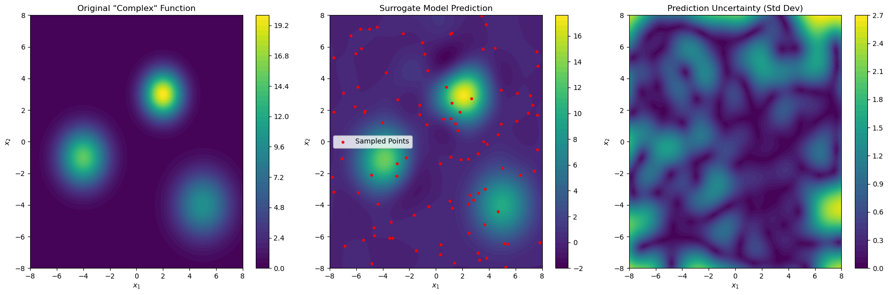

Imagine you're designing a microchip and need to understand its temperature profile. 
Running a full finite element analysis (FEA) simulation to get the temperature at a specific
point on the chip for every possible combination of input parameters (like power consumption, ambient temperature, and heat sink dimensions)
is computationally prohibitive. A single FEA run might take hours.
Instead, we can use a Gaussian Process (GP) surrogate model. 
GPs are powerful for this task because they not only make predictions but also provide an uncertainty estimate for those predictions.
This is crucial in engineering, as it tells you how much you can trust the surrogate model's output in areas where you have sparse data.

